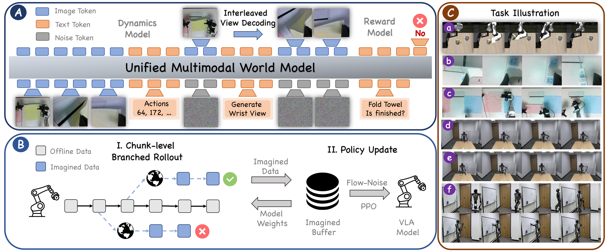

# BAGEL World Model

This repository contains the BAGEL-World-Model code used by [VLA-MBPO](https://arxiv.org/abs/2603.20607).

<p align="center">
  
</p>

## Installation

This repository is intended to use an independent uv environment **from the [VLARLKit](https://github.com/VLARLKit/VLARLKit) root environment**. You need to ensure VLARLKit has already installed.

```bash
cd VLARLKit/third_party/
git clone https://github.com/VLARLKit/BAGEL.git
uv sync
uv pip install flash_attn==2.5.8 --no-build-isolation
```

If you encounter any compilation errors when installing `flash_attn`, you can install a precompiled wheel instead of building from source.

1. Go to the official release page:  
   **https://github.com/Dao-AILab/flash-attention/releases**

2. Download the wheel that matches your environment, typically:
   - **CUDA 12.4**
   - **PyTorch 2.5**
   - **Python 3.10 (cp310)**

3. After downloading the wheel, install it with:

   ```bash
   pip install <wheel_file>
   ```

## Required Artifacts

The model checkpoints and datasets are not bundled in this repository yet.
Before running the full training/inference workflow, prepare the following local paths:

| Artifact | Description | Download Link |
| --- | --- | --- |
| Bagel-WM-ckpt | Fine-tuned world model checkpoints | Coming soon |
| Datasets for finetuning BAGEL | LIBERO and LeRobot datasets for finetuning BAGEL as WMs | Coming soon |

## World-Model Training

World-model training scripts are under `scripts/`:

```bash
bash scripts/train_libero.sh
```

## World-Model Inference
Please refer to our [VLARLKit](https://github.com/VLARLKit/VLARLKit) for details.

## Generation Demos
<p align="center">
  
</p>

## Citation

If you find this code useful, please cite:

```bibtex
@article{zhang2026vlambpo,
  title={Towards Practical World Model-based Reinforcement Learning for Vision-Language-Action Models},
  author={Zhang, Zhilong and Ren, Haoxiang and Sun, Yihao and Sheng, Yifei and Wang, Haonan and Lin, Haoxin and Wu, Zhichao and Bacon, Pierre-Luc and Yu, Yang},
  journal={arXiv preprint arXiv:2603.20607},
  year={2026}
}
```

## Acknowledgements

This codebase builds on [Bagel](https://github.com/bytedance-seed/BAGEL), [UniPlan](https://github.com/uni-plan/uni-plan) stack. We thank the authors and maintainers of these projects.
